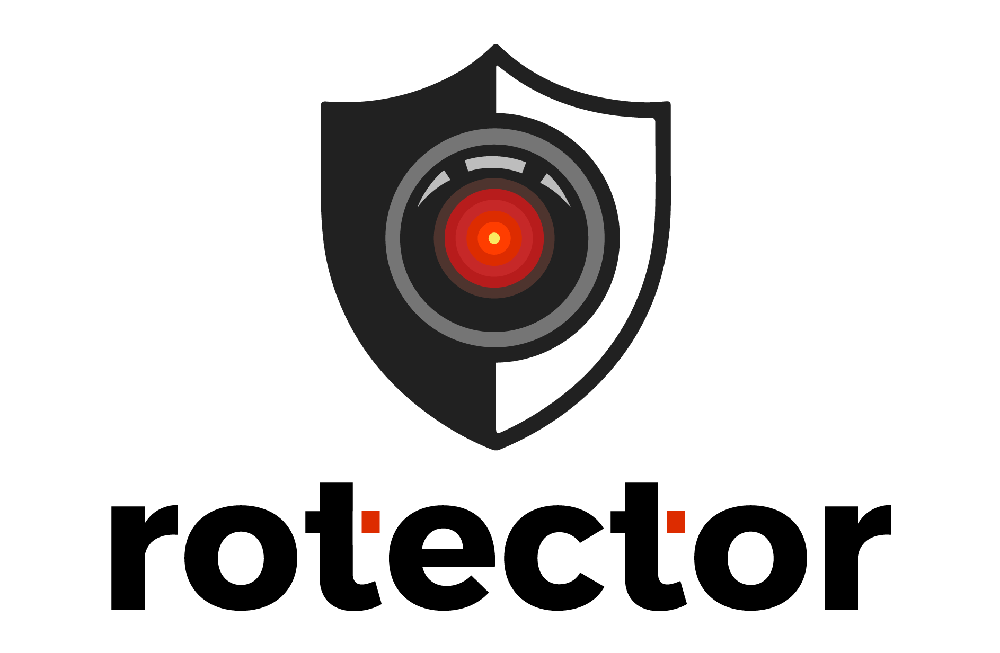

<h1 align="center">
  <picture>
    <source media="(prefers-color-scheme: dark)" srcset="./assets/png/rotector-logo-dark.png">
    <source media="(prefers-color-scheme: light)" srcset="./assets/png/rotector-logo-light.png">
    
  </picture>
  <br>
  <a href="https://github.com/robalyx/rotector-extension/blob/main/LICENSE">
    
  </a>
  <a href="https://github.com/robalyx/rotector-extension/issues">
    
  </a>
  <a href="https://discord.gg/2Cn7kXqqhY">
    
  </a>
  <br>
  <a href="https://chromewebstore.google.com/detail/rotector/ilegibonffbmecfchpcmcmknocboagan">
    
  </a>
  <a href="https://addons.mozilla.org/en-US/firefox/addon/rotector/">
    
  </a>
</h1>

<p align="center">
  <em>A browser extension that integrates with the <a href="https://github.com/robalyx/rotector">Rotector</a> system to help identify inappropriate users on Roblox.</em>
</p>

> [!IMPORTANT]
> This is a **community-driven initiative** and is not affiliated with, endorsed by, or sponsored by Roblox Corporation.

## Install

- **Chrome**: [Chrome Web Store](https://chromewebstore.google.com/detail/rotector/ilegibonffbmecfchpcmcmknocboagan)
- **Firefox**: [Firefox Add-ons](https://addons.mozilla.org/en-US/firefox/addon/rotector/)

Learn more at **[rotector.com](https://rotector.com)**.

## Build from Source

Requires [Bun](https://bun.sh/) v1.2+.

```bash
git clone https://github.com/robalyx/rotector-extension.git
cd rotector-extension
bun install
bun run dev          # Chrome (dev:firefox, dev:edge for others)
bun run build        # Chrome (build:firefox, build:edge for others)
```

Load the built extension:

- **Chrome / Edge**: Go to `chrome://extensions/` or `edge://extensions/` > Enable "Developer mode" > "Load unpacked" > select `.output/chrome-mv3`
- **Firefox**: Go to `about:debugging` > "This Firefox" > "Load Temporary Add-on" > select any file in `.output/firefox-mv3`

## Contributing

1. Fork the repository
2. Create a feature branch
3. Run `bun run quality` before committing
4. Submit a pull request

This project follows the [Contributor Covenant Code of Conduct](CODE_OF_CONDUCT.md).

## Support

- [GitHub Issues](https://github.com/robalyx/rotector-extension/issues)
- [Discord](https://discord.gg/2Cn7kXqqhY)

## License

[GNU General Public License v2.0](LICENSE)
