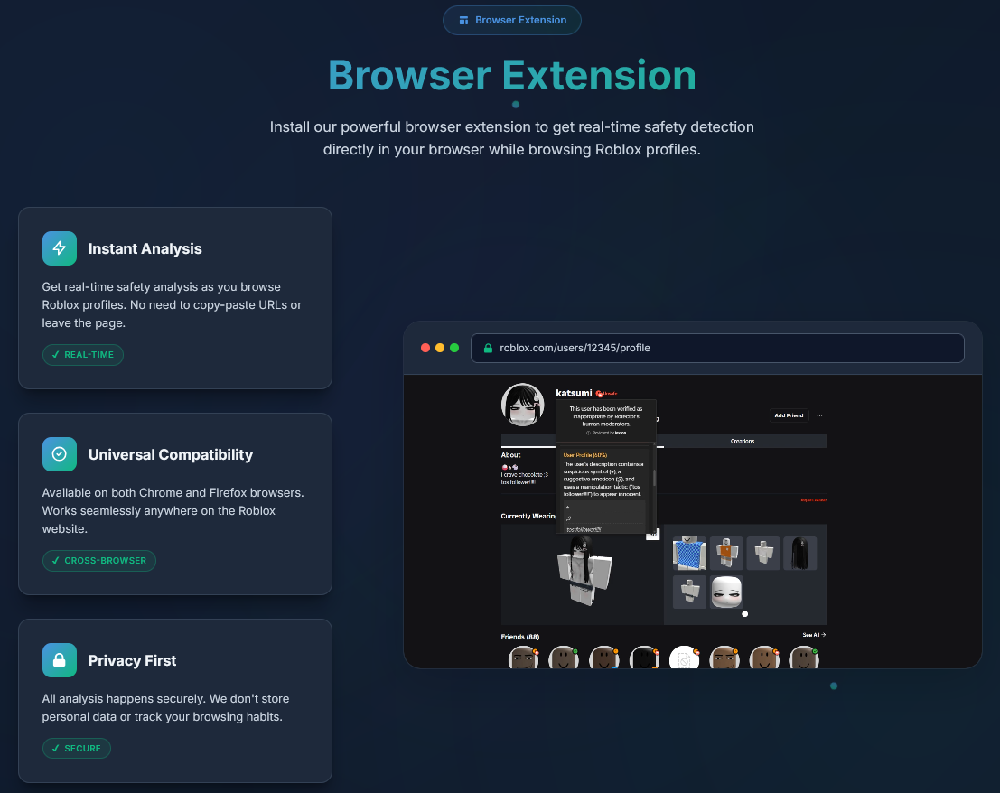

<h1 align="center">
  <picture>
    <source media="(prefers-color-scheme: dark)" srcset="./assets/png/rotector-logo-dark.png">
    <source media="(prefers-color-scheme: light)" srcset="./assets/png/rotector-logo-light.png">
    
  </picture>
  <br>
  <a href="https://github.com/robalyx/rotector-extension/blob/main/LICENSE">
    
  </a>
  <a href="https://github.com/robalyx/rotector-extension/issues">
    
  </a>
  <a href="https://discord.gg/2Cn7kXqqhY">
    
  </a>
</h1>

<p align="center">
  <em>A browser extension that integrates with the <a href="https://github.com/robalyx/rotector">Rotector</a> system to help identify inappropriate users on Roblox.</em>
</p>

---

> [!IMPORTANT]
> This is a **community-driven initiative** and is not affiliated with, endorsed by, or sponsored by Roblox Corporation.

---

## ❓ How It Works

This extension is a browser-based client for the [Rotector](https://github.com/robalyx/rotector) system. It communicates with Rotector's API service to display status indicators for Roblox users directly on the Roblox website.

The extension does not perform any analysis itself. All user analysis is performed by the Rotector system using AI and specialized algorithms. The extension simply displays the results of this analysis to help users identify potentially inappropriate accounts while browsing Roblox.

## 🌐 Learn More

Want to learn more about the Rotector project? Visit our website at **[rotector.com](https://rotector.com)** to explore the full system and see how our browser extension fits into the larger ecosystem of child safety tools.

<p align="center">
  
</p>

<p align="center">
  <a href="https://chromewebstore.google.com/detail/rotector/ilegibonffbmecfchpcmcmknocboagan">
    
  </a>
  <a href="https://addons.mozilla.org/en-US/firefox/addon/rotector/">
    
  </a>
</p>

## 📦 Installation

### 🏪 From Browser Stores
- **Chrome**: [Chrome Web Store](https://chromewebstore.google.com/detail/rotector/ilegibonffbmecfchpcmcmknocboagan)
- **Firefox**: [Firefox Add-ons](https://addons.mozilla.org/en-US/firefox/addon/rotector/)

### 🔧 From Source

#### Prerequisites
- [Bun](https://bun.sh/) (v1.2+)
- Node.js 18+

#### Setup
```bash
# Clone the repository
git clone https://github.com/robalyx/rotector-extension.git
cd rotector-extension

# Install dependencies
bun install

# Development
bun run dev          # Chrome
bun run dev:firefox  # Firefox

# Build for production
bun run build         # Chrome
bun run build:firefox # Firefox

# Create distributable packages
bun run zip          # Chrome
bun run zip:firefox  # Firefox
```

#### 🔄 Loading the Extension

##### Chrome
1. Navigate to `chrome://extensions/`
2. Enable "Developer mode"
3. Click "Load unpacked"
4. Select the `.output/chrome-mv3` directory

##### Firefox
1. Navigate to `about:debugging`
2. Click "This Firefox"
3. Click "Load Temporary Add-on"
4. Select any file in the `.output/firefox-mv3` directory

## 📋 Usage

1. Install the extension in your browser
2. Navigate to any Roblox page (home/profile/friends/groups)
3. Look for safety indicators next to users:
   - 🟢 Safe users
   - 🟡 Flagged (needs review)
   - 🔴 Confirmed as inappropriate
4. Click on indicators for detailed information
5. Use the voting system to help improve accuracy
6. Access settings and statistics via the extension popup

### 🌐 Supported Pages

- **Home Page** (`/home`) - Analyzes users in the friends carousel
- **Profile Pages** (`/users/*/profile`) - Analyzes current user and friends
- **Friends Pages** (`/users/*/friends`, `/users/*/followers`, `/users/*/following`) - Bulk analysis of user lists
- **Groups Pages** (`/groups/*/members`) - Processes group member lists
- **Report Pages** (`/report`) - Automated form filling for flagged users

## 🛠️ Development

### 🔧 Tech Stack

#### Core Technologies
- **Framework**: [WXT](https://wxt.dev/) - Modern web extension framework
- **Frontend**: [Svelte 5](https://svelte.dev/) with runes syntax
- **Language**: [TypeScript](https://www.typescriptlang.org/) (100% type coverage with strict mode)
- **CSS**: [Tailwind CSS 4](https://tailwindcss.com/) with [PostCSS](https://postcss.org/)
- **Build Tool**: [Vite](https://vite.dev/) with [Lightning CSS](https://lightningcss.dev/) minification
- **Package Manager**: [Bun](https://bun.sh/) (v1.2+)

#### Development Tools
- **Code Quality**: [ESLint](https://eslint.org/) with TypeScript and Svelte plugins
- **Dead Code**: [Knip](https://knip.dev/) for analysis
- **Type Checking**: [svelte-check](https://www.npmjs.com/package/svelte-check) with TypeScript integration
- **Hot Reload**: Built-in with [WXT](https://wxt.dev/) development tools

### ✅ Quality Checks
```bash
# Run all quality checks
bun run quality

# Individual checks
bun run check        # Svelte type checking
bun run lint         # ESLint
bun run lint:fix     # ESLint + Auto-fix
bun run knip         # Dead code detection
```

### 📁 Project Structure
```
src/
├── assets/          # Static assets
├── components/      # Svelte 5 components
│   ├── features/    # Main feature components
│   ├── popup/       # Extension popup components
│   ├── status/      # Status indicators
│   └── ui/          # Reusable UI components
├── entrypoints/     # Extension entry points
│   └── popup/       # Popup interface
├── lib/             # Core logic
│   ├── controllers/ # Page-specific controllers
│   ├── services/    # API and external services
│   ├── stores/      # State management
│   ├── types/       # TypeScript definitions
│   └── utils/       # Utility functions
└── styles/          # Organized CSS modules
    ├── base/        # Foundation styles
    ├── components/  # Generic component styles
    ├── features/    # Feature-specific styles
    │   ├── changelog/
    │   ├── modal/
    │   ├── report-helper/
    │   ├── settings/
    │   ├── statistics/
    │   └── tooltip/
    └── theme/       # Design tokens
```

## 🤝 Contributing

Contributions are welcome! Please:
1. Fork the repository
2. Create a feature branch
3. Run quality checks before committing
4. Submit a pull request

Please note that this project follows the [Contributor Covenant Code of Conduct](CODE_OF_CONDUCT.md).

## 💬 Support

- **Issues**: [GitHub Issues](https://github.com/rotector/rotector-extension-v2/issues)
- **Discord**: [Join our Discord](https://discord.gg/2Cn7kXqqhY)

## 📄 License

This project is licensed under the GNU General Public License v2.0 - see the [LICENSE](LICENSE) file for details.

---

Built with ❤️ for a safer Roblox community